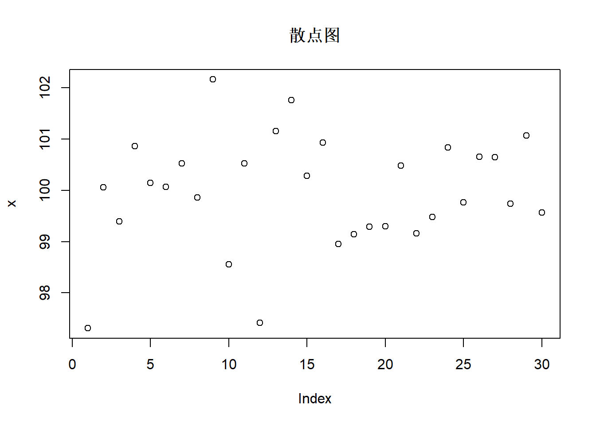

# 第1次作业解答


## Question
Produce 3 examples(texts,figures,tables)


## Answer

### Texts

```r
a=c("今天","吃饭")
b=c("你","了吗?")
d=paste0(a,b,collapse="")  ## 拼接字符串a,b
d
```

```
## [1] "今天你吃饭了吗?"
```


### Figures

```r
## 从均值为100，方差为1的正态分布中，随机生成30个数
x <- rnorm(30, mean=100, sd=1)
print(round(x,2))
```

```
##  [1]  97.31 100.06  99.39 100.87 100.15 100.07 100.52  99.86 102.16  98.56
## [11] 100.52  97.42 101.16 101.76 100.29 100.94  98.96  99.15  99.29  99.30
## [21] 100.49  99.16  99.48 100.84  99.76 100.66 100.65  99.74 101.07  99.57
```

```r
## 30个随机数的散点图
plot(x,main="散点图")
```



```r
## 30个随机数的直方图
hist(x, col=rainbow(15), 
     main='正态随机数', xlab='', ylab='频数')
```


### ggplot2
ggplot2包的mpg数据集:(从1999年到2008年38款流行车型的燃油经济性数据)
，234*11的数据规模，记录了制造厂商，型号，类别，驱动程序和耗油量

+ cty 和hwy分别记录城市和高速公路驾驶耗油量
+ cyl:气缸数
+ displ:发动机排量
+ drv:驱动系统：前轮驱动(f)、后轮驱动和四轮驱动(4)
+ class:车辆类型,如双座汽车,suv,小型汽车
+ fl:燃料类型


```r
## 用ggplot2画图
library(ggplot2)
data(mpg)  ## 导入mpg数据集

ggplot(data=mpg,mapping = aes(x=cty,y=hwy,color=factor(year)))+
  geom_point()+stat_smooth(method = 'loess')+
  scale_shape_manual(values = c(2,5))+
  labs(y = '每加仑高速公路行驶距离', x = '每加仑城市公路行驶距离',
       title = '汽车油耗与型号', size = '排量', colour = '车型')+
  theme(plot.title = element_text(hjust = 0.5))
```

```
## `geom_smooth()` using formula 'y ~ x'
```


### Tables


```r
library(xtable)
## 显示表格
knitr::kable(head(mpg))
```


|manufacturer |model | displ| year| cyl|trans      |drv | cty| hwy|fl |class   |
|:------------|:-----|-----:|----:|---:|:----------|:---|---:|---:|:--|:-------|
|audi         |a4    |   1.8| 1999|   4|auto(l5)   |f   |  18|  29|p  |compact |
|audi         |a4    |   1.8| 1999|   4|manual(m5) |f   |  21|  29|p  |compact |
|audi         |a4    |   2.0| 2008|   4|manual(m6) |f   |  20|  31|p  |compact |
|audi         |a4    |   2.0| 2008|   4|auto(av)   |f   |  21|  30|p  |compact |
|audi         |a4    |   2.8| 1999|   6|auto(l5)   |f   |  16|  26|p  |compact |
|audi         |a4    |   2.8| 1999|   6|manual(m5) |f   |  18|  26|p  |compact |

