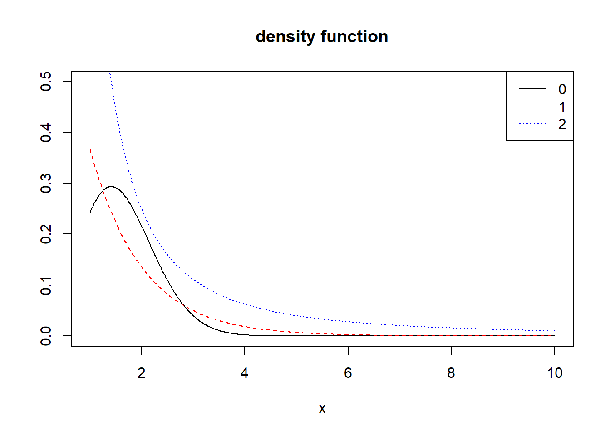
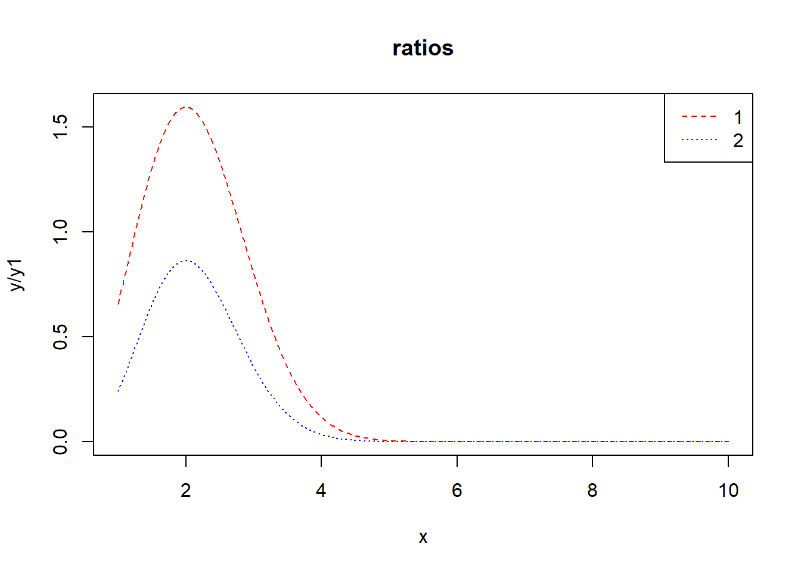

# 第3次作业解答

## Question
Exercises 5.4, 5.9, 5.13, and 5.14


## Answer

### 5.4
Write a function to compute a Monte Carlo estimate of the Beta(3, 3) cdf,
and use the function to estimate F(x) for x = 0.1, 0.2, . . ., 0.9. Compare the
estimates with the values returned by the pbeta function in R.

Solution: $Beta(3,3)=\int_0^1 t^2(1-t)^2dt$


```r
MCBeta = function(x,n=10000){
  t=runif(n, min = 0, max = x)
  theta.hat=x*mean(t*t*(1-t)*(1-t))/beta(3,3)
  return(theta.hat)
}
x=seq(0.1,0.9,0.1)

MC.Beta=pbeta=rep(0,9)
for(i in 1:9)
{
  MC.Beta[i]=MCBeta(x[i])
  pbeta[i]=pbeta(x[i],3,3)
}
out=rbind(MC.Beta,pbeta)

rownames(out)=c("MC.Beta","pbeta")
colname=NULL
for(i in 9:1){
  name=paste("x=",x[i])
  colname=cbind(name,colname)
}
colnames(out)=colname

out
```

```
##             x= 0.1     x= 0.2    x= 0.3    x= 0.4    x= 0.5    x= 0.6    x= 0.7
## MC.Beta 0.00857653 0.05822932 0.1639852 0.3169921 0.4993018 0.6828323 0.8433748
## pbeta   0.00856000 0.05792000 0.1630800 0.3174400 0.5000000 0.6825600 0.8369200
##            x= 0.8    x= 0.9
## MC.Beta 0.9531993 0.9921696
## pbeta   0.9420800 0.9914400
```


### 5.9
The Rayleigh density $[156,(18.76)]$ is
$$
f(x)=\frac{x}{\sigma^{2}} e^{-x^{2} /\left(2 \sigma^{2}\right)}, \quad x \geq 0, \sigma>0
$$
Implement a function to generate samples from a Rayleigh $(\sigma)$ distribution, using antithetic variables. What is the percent reduction in variance of $\frac{X+X^{\prime}}{2}$ compared with $\frac{X_{1}+X_{2}}{2}$ for independent $X_{1}, X_{2} ?$


```r
rayleigh=function(scale, n) {
  rayleigh=antithetic=numeric(n)
  for (i in 1:n) {
    U =runif(n)
    V = 1 - U
    rayleigh = scale * sqrt(-2 * log(U))
    antithetic = scale * sqrt(-2 * log(V))
    out$ray=rayleigh
    out$ant=antithetic
  }
  return(out)
}

scale=2
n=1000
out=rayleigh(scale, n)
```

```
## Warning in out$ray <- rayleigh: 把公式左手强迫变成串列
```

```r
var1 = var(out$ray)
var2 =(var(out$ray) + var(out$ant) + 2 * cov(out$ray, out$ant)) / 4
reduction = ((var1 - var2) / var1)
cat("reduction=",100*reduction,"%")
```

```
## reduction= 97.51797 %
```

### 5.13
Find two importance functions $f_{1}$ and $f_{2}$ that are supported on $(1, \infty)$ and are 'close' to
$$
g(x)=\frac{x^{2}}{\sqrt{2 \pi}} e^{-x^{2} / 2}, \quad x>1
$$
Which of your two importance functions should produce the smaller variance in estimating
$$
\int_{1}^{\infty} \frac{x^{2}}{\sqrt{2 \pi}} e^{-x^{2} / 2} d x
$$
by importance sampling? Explain.

Solution: 
Consider $$f_1(x) = e^{-x}, x \in (1,\infty)$$ and $$f_2(x) = \frac{1}{x^2}, x \in (1,\infty)$$


```r
x =seq(1,10,0.02)
y = x^2/sqrt(2*pi)* exp((-x^2/2))
y1 = exp(-x)
y2 =1 / (x^2)

gs =c(expression(g(x)==e^{-x^2/2}*x^2/sqrt(2*pi)),expression(f[1](x)==1/(x^2)),expression(f[2](x)==x*e^{(1-x^2)/4}/sqrt(2*pi)))

plot(x, y, type = "l", ylab = "", ylim = c(0,0.5),main='density function')
lines(x, y1, lty = 2,col="red")
lines(x, y2, lty = 3,col="blue")
legend("topright", legend = 0:2,lty = 1:3,col=c("black","red","blue"))
```



```r
plot(x, y/y1,type = "l",lty = 2, col="red",main = 'ratios')
lines(x, y/y2, lty = 3,col="blue")
legend("topright", legend = 1:2,lty = 2:3,col=c("red","blue"))
```




```r
f1 = function(x) { exp(-x) }
f2 = function(x) { (pi * (1 + x^2))^(-1) * (x >= 1) }
g =function(x) {x^2*exp(-x^2/2)/sqrt(2*pi)*(x>1)}

m = 10^7
x1 = rexp(m)
x2 = rcauchy(m)
x2[which(x2 < 1)] = 1 

fg = cbind(g(x1) / f1(x1), g(x2) / f2(x2))

theta.hat = se = numeric(2)
theta.hat =c(mean(fg[,1]), mean(fg[,2]))
se = c(sd(fg[,1]), sd(fg[,2]))
rbind(theta.hat, se)
```

```
##                [,1]      [,2]
## theta.hat 0.4007853 0.4003510
## se        0.5859000 0.9585166
```


### 5.14
Obtain a Monte Carlo estimate of
$$
\int_{1}^{\infty} \frac{x^{2}}{\sqrt{2 \pi}} e^{-x^{2} / 2} d x
$$
by importance sampling.


```r
g =function(x) {x^2*exp(-x^2/2)/sqrt(2*pi)*(x>1)}
m = 1e4                 
u = runif(m) 
x = 1/(1-u)  
fg = g(x)*x^2
theta.hat = mean(fg)
print(theta.hat)
```

```
## [1] 0.3995721
```

```r
theta =integrate(g,1,Inf)
theta
```

```
## 0.400626 with absolute error < 5.7e-07
```


