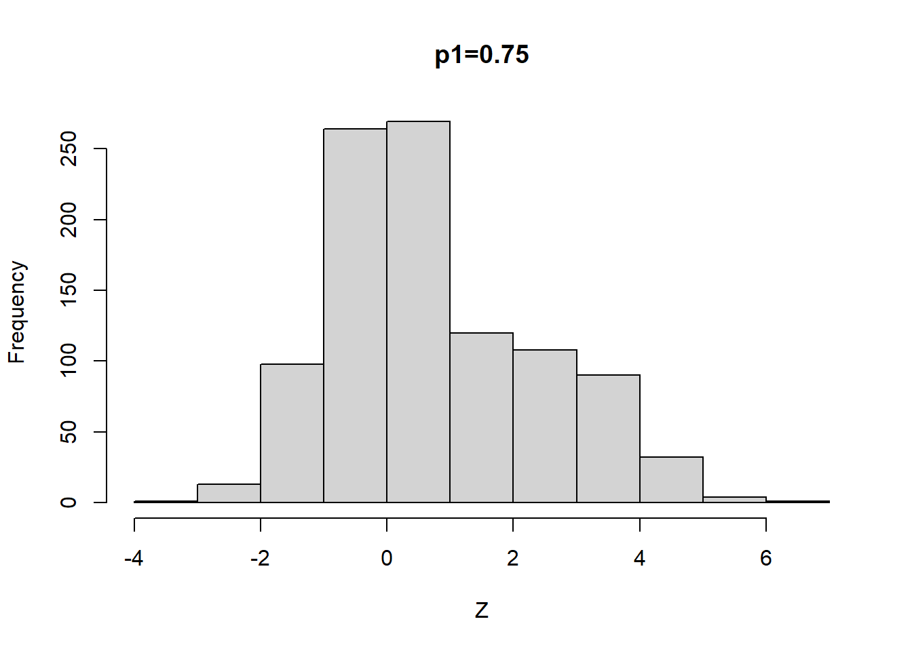

# 第2次作业解答

## Question
3.4, 3.11, and 3.20


## Answer

### 3.4 
The Rayleigh density [156, Ch. 18] is
$$
f(x)=\frac{x}{\sigma^{2}} e^{-x^{2} /\left(2 \sigma^{2}\right)}, \quad x \geq 0, \sigma>0 .
$$
Develop an algorithm to generate random samples from a Rayleigh $(\sigma)$ distribution. Generate Rayleigh $(\sigma)$ samples for several choices of $\sigma>0$ and check that the mode of the generated samples is close to the theoretical mode $\sigma$ (check the histogram).

*解:* 

Rayleigh随机变量$X$的分布函数:
$$
F(x)=1-\exp \left(-\frac{x^{2}}{2 \sigma^{2}}\right), x \geq 0
$$
所以$F^{-1}(y)=\sigma \sqrt{-2 \ln (1-y)}$


```r
Rayleigh =function(sigma, n){
  for(i in 1:n) {
    U=runif(n)
    V=1-U
    X = sigma * sqrt(-2 * log(V))
  }
  return(X)
}
sigma = 2
n = 1000

hist(Rayleigh(sigma, n),main = "Rayleigh",xlab="")
```


#### 多试几组sigma

```r
sigma=c(1:9)
n=1000
par(mfrow=c(3,3))
for(i in 1:9){
  title=paste0("sigma=",sigma[i])
  hist(Rayleigh(sigma[i], n),main = title,xlab="")
}
```


### 3.11
Generate a random sample of size 1000 from a normal location mixture. The components of the mixture have $N(0,1)$ and $N(3,1)$ distributions with mixing probabilities $p_{1}$ and $p_{2}=1-p_{1}$. Graph the histogram of the sample with density superimposed, for $p_{1}=0.75 .$ Repeat with different values for $p_{1}$ and observe whether the empirical distribution of the mixture appears to be bimodal. Make a conjecture about the values of $p_{1}$ that produce bimodal mixtures.

 
#### p1取0.75

```r
n=1000
X1=rnorm(n,0,1)
X2=rnorm(n,3,1)
u <- runif(n)
p1=as.integer(u < 0.75) 
p2=1-p1
Z=p1*X1+p2*X2
hist(Z,main = "p1=0.75")
```




#### p1从0变化到1

```r
p=seq(0,1,0.1)
par(mfrow=c(3,4))
for(i in 1:11){
  p1=as.integer(u < p[i]) 
  p2=1-p1
  Z=p1*X1+p2*X2
  title=paste0("p1=",p[i])
  hist(Z,main=title)
}
```


把$p1$的值从0变化到1，发现: 当$p1$在$0.5$附近的时候容易出现双峰.


### 3.20
A compound Poisson process is a stochastic process $\{X(t), t \geq 0\}$ that can be represented as the random sum $X(t)=\sum_{i=1}^{N(t)} Y_{i}, t \geq 0$, where $\{N(t), t \geq 0\}$ is a Poisson process and $Y_{1}, Y_{2}, \ldots$ are id and independent of $\{N(t), t \geq 0\}$. Write a program to simulate a compound Poisson $(\lambda)$-Gamma process $(Y$ has a Gamma distribution). Estimate the mean and the variance of $X(10)$ for several choices of the parameters and compare with the theoretical values. Hint: Show that $E[X(t)]=\lambda t E\left[Y_{1}\right]$ and $\operatorname{Var}(X(t))=\lambda t E\left[Y_{1}^{2}\right]$.


```r
Poisson_Gamma=function(n, t, lambda, r, beta) {
  N =rpois(n, lambda * t)
  X=sapply(N, function(N, r, beta) sum(rgamma(N, r,beta)), r,beta)
  return(X)
}

test=function(n, t, lambda, r, beta) {
  x=Poisson_Gamma(n, t, lambda, r,beta)
  ## 样本均值
  sm=mean(x) 
  ## 理论均值
  vm=var(x)
  ## 样本方差
  tm=lambda * t * r/beta
  ## 理论方差
  tv=lambda * t * (1 + r) * r/beta^2
  
  ## 输出结果样式
  cat("r=",r,"beta=",beta,"\n")
  cat("样本均值:", sm, "  ")
  cat("理论均值:", vm, "\n")
  cat("样本方差:", tm, "  ")
  cat("理论方差:", tv, "\n\n")
}

## 参数值
n=1000
lambda_seq=c(1:3)
r_seq=c(1:3)
beta_seq=c(1:3)
t=10

for (lambda in lambda_seq) {
  for (r in r_seq) {
    for (beta in beta_seq) {
      test(n, t, lambda,r,beta)
    }
  }
}
```

```
## r= 1 beta= 1 
## 样本均值: 10.13995   理论均值: 20.32931 
## 样本方差: 10   理论方差: 20 
## 
## r= 1 beta= 2 
## 样本均值: 5.027542   理论均值: 5.122507 
## 样本方差: 5   理论方差: 5 
## 
## r= 1 beta= 3 
## 样本均值: 3.265739   理论均值: 2.151635 
## 样本方差: 3.333333   理论方差: 2.222222 
## 
## r= 2 beta= 1 
## 样本均值: 20.30287   理论均值: 57.41383 
## 样本方差: 20   理论方差: 60 
## 
## r= 2 beta= 2 
## 样本均值: 9.999458   理论均值: 14.53053 
## 样本方差: 10   理论方差: 15 
## 
## r= 2 beta= 3 
## 样本均值: 6.73496   理论均值: 6.629095 
## 样本方差: 6.666667   理论方差: 6.666667 
## 
## r= 3 beta= 1 
## 样本均值: 30.30231   理论均值: 118.2465 
## 样本方差: 30   理论方差: 120 
## 
## r= 3 beta= 2 
## 样本均值: 15.11182   理论均值: 27.71993 
## 样本方差: 15   理论方差: 30 
## 
## r= 3 beta= 3 
## 样本均值: 10.21209   理论均值: 12.56694 
## 样本方差: 10   理论方差: 13.33333 
## 
## r= 1 beta= 1 
## 样本均值: 19.96456   理论均值: 36.82655 
## 样本方差: 20   理论方差: 40 
## 
## r= 1 beta= 2 
## 样本均值: 10.00615   理论均值: 9.118354 
## 样本方差: 10   理论方差: 10 
## 
## r= 1 beta= 3 
## 样本均值: 6.738377   理论均值: 4.248777 
## 样本方差: 6.666667   理论方差: 4.444444 
## 
## r= 2 beta= 1 
## 样本均值: 40.12376   理论均值: 123.9692 
## 样本方差: 40   理论方差: 120 
## 
## r= 2 beta= 2 
## 样本均值: 19.5177   理论均值: 27.81749 
## 样本方差: 20   理论方差: 30 
## 
## r= 2 beta= 3 
## 样本均值: 13.40187   理论均值: 12.5441 
## 样本方差: 13.33333   理论方差: 13.33333 
## 
## r= 3 beta= 1 
## 样本均值: 59.16332   理论均值: 246.9506 
## 样本方差: 60   理论方差: 240 
## 
## r= 3 beta= 2 
## 样本均值: 29.44541   理论均值: 60.21091 
## 样本方差: 30   理论方差: 60 
## 
## r= 3 beta= 3 
## 样本均值: 19.78897   理论均值: 27.88206 
## 样本方差: 20   理论方差: 26.66667 
## 
## r= 1 beta= 1 
## 样本均值: 29.92132   理论均值: 60.62193 
## 样本方差: 30   理论方差: 60 
## 
## r= 1 beta= 2 
## 样本均值: 15.01278   理论均值: 14.7987 
## 样本方差: 15   理论方差: 15 
## 
## r= 1 beta= 3 
## 样本均值: 10.06794   理论均值: 6.850183 
## 样本方差: 10   理论方差: 6.666667 
## 
## r= 2 beta= 1 
## 样本均值: 59.99879   理论均值: 159.5041 
## 样本方差: 60   理论方差: 180 
## 
## r= 2 beta= 2 
## 样本均值: 29.78936   理论均值: 43.59528 
## 样本方差: 30   理论方差: 45 
## 
## r= 2 beta= 3 
## 样本均值: 20.00276   理论均值: 18.73035 
## 样本方差: 20   理论方差: 20 
## 
## r= 3 beta= 1 
## 样本均值: 90.57764   理论均值: 360.9857 
## 样本方差: 90   理论方差: 360 
## 
## r= 3 beta= 2 
## 样本均值: 45.13285   理论均值: 96.8139 
## 样本方差: 45   理论方差: 90 
## 
## r= 3 beta= 3 
## 样本均值: 29.82794   理论均值: 37.86575 
## 样本方差: 30   理论方差: 40
```


